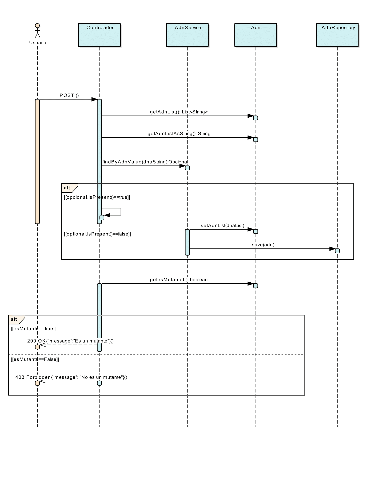

# Mutant Detection API
Este proyecto incluye un servicio en la API para detectar si una secuencia de ADN pertenece a un mutante.

Requisitos
Java 11 o superior
Gradle
Spring Boot
Dependencias: spring-boot-starter-web, spring-boot-starter-data-jpa, H2 Database
## Ejecución
Descargar el repositorio
Compilar y ejecutar la API:


./gradlew bootRun
Uso del servicio /mutant/
Endpoint:
POST /mutant/

Descripción:
Detecta si una secuencia de ADN corresponde a un mutante.

**Ejemplo de Request**

Enviar una solicitud POST al siguiente Endpoint: 
- Render:  https://parcial1-3k9-2.onrender.com/api/v1/adn/mutant/
- Local:  http://localhost:8080/api/v1/adn/mutant/  (el proyecto se debe estar ejecutando)

con un cuerpo JSON como el siguiente:

```json
  {
    "dna": [
        "CTGTCA",
        "CAGTGC",
        "ATATGT",
        "GAGAGA",
        "CCCCCC",
        "TCACTG"
    ]
}
  ```
**Respuestas**

200 OK: Si la secuencia corresponde a un mutante.
{
  "message": "Es un mutante"
}


403 Forbidden: Si la secuencia no corresponde a un mutante.
{
  "message": "No es un mutante"
}


400 Bad Request: Si ocurre un error en el formato de los datos.

### Uso del servicio /stats
**Descripción:** 
Retorna estadísticas sobre la cantidad de ADN mutante y humano verificados.

**Ejemplo de Request:**

Enviar una solicitud **GET** al uno de los siguientes Endpoint: 
- Render: https://parcial1-3k9-2.onrender.com/api/v1/adn/stats
- Local: http://localhost:8080/api/v1/adn/stats (El proyecto se debe estar ejecutando)

**Respuesta**
```json
{
  "count_mutant_dna": 80,
  "count_human_dna": 100,
  "ratio": 0.8
}
```

## Diagrama de Secuencia

*SALUDOS*